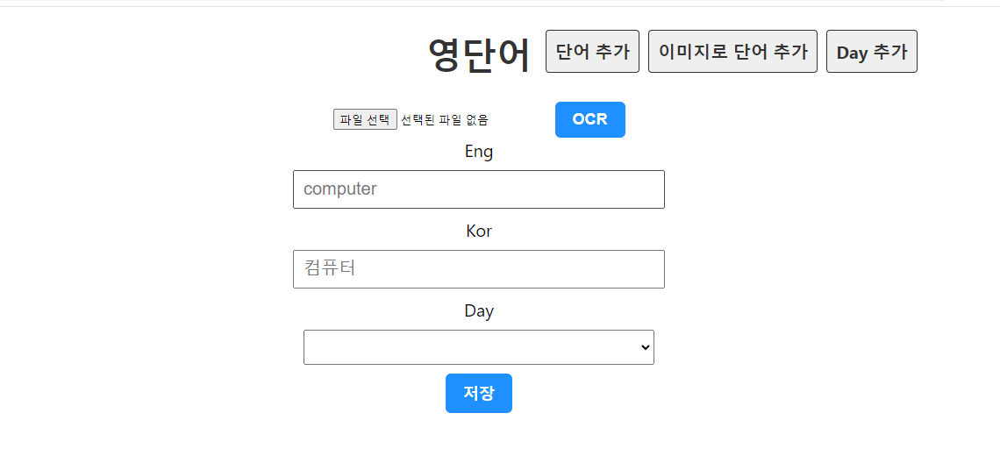
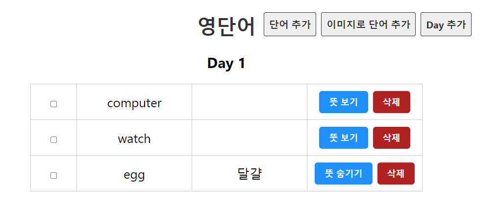

# 이미지 텍스트 추출 영단어장 웹서비스
**PNU CC Team16**

장인성: Frontend(Google OCR API)

배민준: Frontend(React),Backend,Docker

네메흐바얄 노민: MS Azure VM

김도훈: QA Test, Document


## 프로젝트 소개

Google Cloud OCR API를 활용한 영어 단어장 웹서비스 입니다. 

타이핑 및 이미지 업로드를 통해 DB에 단어를 추가하고 설정한 일정에 맞춰 단어 학습을 할 수 있습니다. 


**개발환경**
- FrontEnd: React
- BackEnd: Python, django
- DB: MySQL
- 배포: MS Azure, Docker


## 프로젝트 필요성
이미지 텍스트 추출 기능을 활용하여 책이나 논문 등의 텍스트를 디지털로 변환하여 필요한 부분을 추출하고 학습에 활용 하거나 

해외 여행 중에 모르는 간판 등을 사진으로 찍어 업로드 하여 번역기에 돌리거나 단어장에 추가할 수 있습니다.


## 관련 기술/논문/특허 조사 내용
**1. Quizlet.com**

이미지, 오디오를 업로드 할 수 있는 낱말카드 서비스 제공, 직접 카드 set을 만들거나 

다른 사용자의 카드 set를 사용하여 학습 가능, 테스트 모드로 생성한 낱말카드 기반의 퀴즈 제공

https://quizlet.com/features/flashcards

**2. classcard.net**

사용자가 직접 만드는 단어장 이외에도 출판사 연계 단어장 제공

원어민 발음 및 다양한 퀴즈와 학습결과 리포트 제공

https://www.classcard.net/


## 프로젝트 개발 결과물

**메인 화면**


---
**단어장 UI**


---

**구성도**


## How To Use
2024 PNU cloud computing term project (3 tier architecture using docker, google cloud vision OCR, CSP)

Download folder CC

Use the command
```
docker-compose up
```

check

[our website for the term project](http://localhost:3000)

[django backend](http://localhost:8000)

Check code or ask mbae059 for code explanation

django debug page is enough when checking django backend, which is localhost:8000


### To Use OCR(Optical Character Recognition)

> The purpose of OCR is to test and use Google Cloud Vision API's OCR
> The term project uses not only Docker but *CLOUD* vision as well


1. The image needs to have 2 words
2. Those 2 words needs to be English and Korean (order matters!)

[example image](https://raw.githubusercontent.com/mbae059/CC_term_project/master/ocr_example.png)


### [Link for backend code](https://github.com/mbae059/CC_term_project_backend)
### [Link for frontend code](https://github.com/mbae059/CC_term_project_frontend)


## 활용방안
1. **실생활 영어 학습** : Image to Text 기능을 강화하여 일상 생활에서 접하는 간판, 메뉴, 광고 등의 이미지를 업로드하여 영어 단어를 추출하고 학습할 수 있습니다.

2. **다국어 학습 지원** : 다른 언어로도 서비스를 확장하여 다국어 학습을 지원할 수 있습니다.

3. **게임 및 놀이 요소 결합** : 단어 맞추기 게임, 퍼즐 등 다양한 놀이 요소를 추가하여 학습의 재미를 더할 수 있습니다.

4. **협동 학습** : 사용자들이 추출한 단어장을 공유하고, 함께 학습할 수 있는 기능을 추가할 수 있습니다. 
